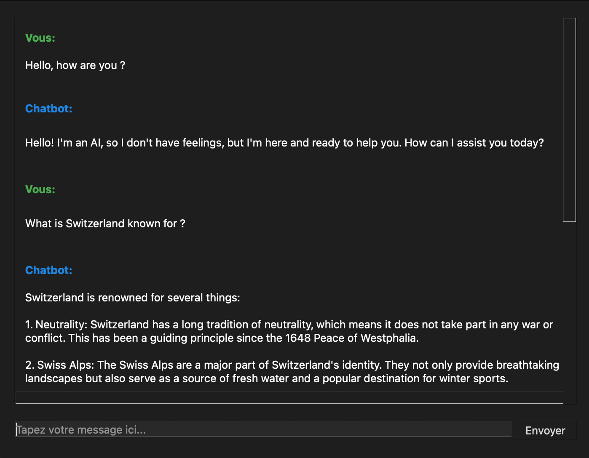

# Mistral AI Chatbot  

An interactive chatbot application built with Mistral AI API and PyQt5 for a seamless user experience.  

## Features  
- **Real-time conversation**: Generates intelligent responses using the Mistral AI API.  
- **User-friendly interface**: Designed with PyQt5 for smooth and intuitive interactions.  
- **Secure API management**: Uses environment variables (`dotenv`) to keep API keys safe.  
- **Easy setup**: Minimal dependencies and straightforward installation.  

## Installation  

1. **Clone the repository**  
   ```bash
   git clone https://github.com/Adlan-Boithier/chatbot-project.git
   cd chatbot-project
